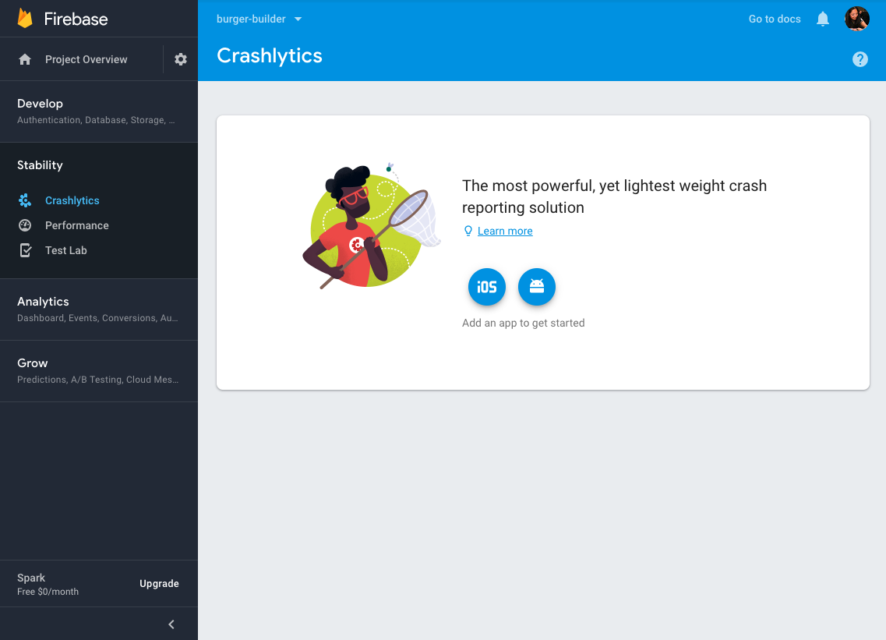
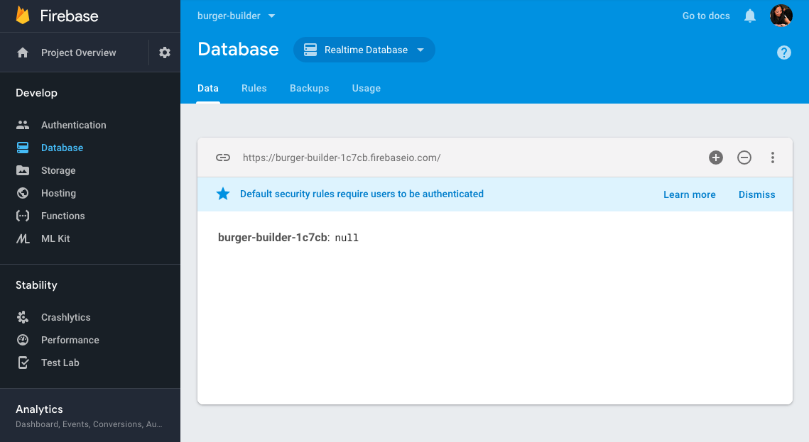

## Burger Builder Project: Accessing a Server

We'd like to store the orders and get the orders. 
We're going to implement a backend so we can store our orders. 
This way, we'll have a way to retrieve them even after the page was reloaded. 

We're going to use Firebase, which is a service offered by Google. This will be sort of a dummy backend.

- Visit [firebase.google.com](https://firebase.google.com/) and click on [visit console](https://console.firebase.google.com/u/0/project/_/crashlytics).
- Click on `add project`, name it, and click `create project`.
- You should be navigated to the project's dashboard, that at the time of writing this looks like this: 

 
- On the left hand menu, click on `Develop` -> `Database` -> `create Database`.
- On the top row, next to the title `Database` choose the option `Realtime Database`. 
- The top row should show you the API endpoint you're going to use. In my project, it's set to `https://react-my-burger-shirleyxting.firebaseio.com/`: 

  

	This URL (`https://react-my-burger-shirleyxting.firebaseio.com/`) is the endpoint where we can send data to, and it will automatically be stored in our database. 
- One last thing to set up is `rules`: click on the `rules` tab, and change both `.read` and `.write` to `true`: 

	```json
	{
	    "rules": {
	        ".read": "true",
	        ".write": "true"
	    }
	}
	```
	This is set to authenticated users by default, but we haven't implemented authentication in our app, 
	so we need to set it to true. We have no authenticated users. This way, everyone can read or write. 
- Save your edits, and make sure you see the notification `rules published` before moving back to the `data` tab.

Our dummy server is now ready! We can now send HTTPS requests to our backend. 


### Creating the axios instance 

- install axios 
- restart your project 
- add axios to our project by creating a new instance of axios. 
	- Create a file called `axios-orders.js`
	- inside the file set up the baseURL
	- export the instance 
	
	```javascript
	import axios from 'axios';

	const instance = axios.create({
	 	baseURL: 'https://react-my-burger-shirleyxting.firebaseio.com/'
	 });
	  
	export default instance;
	```
We now have an axios instance. 

### Sending a POST request 

We now want to send requests to the axios instance. Inside the burgerbuilder container we give the user an alert when he/she choose to `continue`. 

We can now use our dummy server to save the user order summary. 

- In the `Burger-Builder.js` file we first need to import our axios instance: `import axios from '../../axios-orders';`. 
- We can now use axios to send a post request, like so: 

	```javascript
	purchaseContinuedHandler = () => {
		axios.post('/orders.json');
	}
	```
	- The `.json` extention is a requirement if you're using Firebase, and might not be necessary in your server.
	- Another thing about Firebase: once we use a string like `/orders`, Firebase will create a folder by that name and store the data in there. 

Now that everything is set up, we can send some data. We create a variable `order` with the information we want to send. We then add `order` as an argument to `axios.post`. 

We probaly also want to handle responses and errors, so all together your code should look like so: 

```javascript
purchaseContinuedHandler = () => {
	const order = {
		ingredients: this.state.ingredients,
		price: this.state.totalPrice,
		customer: {
			name: 'Michal Weizman',
			address: {
				street: 'SomeStreet',
				zipCode: 43312,
				country: 'UK'
			},
			email: 'test@test.com'
		},
		deliveryMethod: 'fastest'
	}
	axios.post('/orders.json', order)
		.then(response => console.log(response))
		.catch(error => console.log(error));
}
```

Once you save and create an order in your app, you should click `continue` and see the response in your console (no error in your conole, hopefully). 

Inside `Firebase` you should also see the folder `orders` was created, and your new order should appear inside it. 
Each post method gets a unique id. Inside it you should find the information of the order. 


### Displaying a spinner while sending a request 

We should dislay some feedback to the user when they click `continue`. Our goal is to add a spinner component inside the order summary. Here's how to do this: 

- Create a `Spinner` folder and inside create a `Spinner.js` file and `Spinner.css`.
- You can use one of these [css-loaders](https://projects.lukehaas.me/css-loaders/).
- Here's an example of a `Spinner.css` file(note that it's best to change the classname `loader` to `Loader` with capital L, just to be consistent with our other css files):

	**Spinner.css**:
	
	```css
	.Loader {
	  font-size: 10px;
	  margin: 50px auto;
	  text-indent: -9999em;
	  width: 11em;
	  height: 11em;
	  border-radius: 50%;
	  background: #550967;
	  background: -moz-linear-gradient(left, #550967 10%, rgba(85,9,103, 0) 42%);
	  background: -webkit-linear-gradient(left, #550967 10%, rgba(85,9,103, 0) 42%);
	  background: -o-linear-gradient(left, #550967 10%, rgba(85,9,103, 0) 42%);
	  background: -ms-linear-gradient(left, #550967 10%, rgba(85,9,103, 0) 42%);
	  background: linear-gradient(to right, #550967 10%, rgba(85,9,103, 0) 42%);
	  position: relative;
	  -webkit-animation: load3 1.4s infinite linear;
	  animation: load3 1.4s infinite linear;
	  -webkit-transform: translateZ(0);
	  -ms-transform: translateZ(0);
	  transform: translateZ(0);
	}
	.Loader:before {
	  width: 50%;
	  height: 50%;
	  background: white;
	  border-radius: 100% 0 0 0;
	  position: absolute;
	  top: 0;
	  left: 0;
	  content: '';
	}
	.Loader:after {
	  background: white;
	  width: 75%;
	  height: 75%;
	  border-radius: 50%;
	  content: '';
	  margin: auto;
	  position: absolute;
	  top: 0;
	  left: 0;
	  bottom: 0;
	  right: 0;
	}
	@-webkit-keyframes load3 {
	  0% {
	    -webkit-transform: rotate(0deg);
	    transform: rotate(0deg);
	  }
	  100% {
	    -webkit-transform: rotate(360deg);
	    transform: rotate(360deg);
	  }
	}
	@keyframes load3 {
	  0% {
	    -webkit-transform: rotate(0deg);
	    transform: rotate(0deg);
	  }
	  100% {
	    -webkit-transform: rotate(360deg);
	    transform: rotate(360deg);
	  }
	}
	```   
	
	**spinner.js**: 
	
	```javascript
	import React from 'react';
	import classes from './Spinner.css';

	const spinner = () => (<div className={classes.Loader}>Loading...</div>);

	export default spinner;
	```
- All that's left to do is to add the spinner after the user clicks `continue`. The loader should only show when the request is awaiting respons. 
	- Inside `burgerBuilder.js` add a `loading` field to the state and set it to `false`.
	- We want to conditionally render either the order summary or the spinner, according to the `loading` field. 
	- In the render() method, add the code: 

	```javascript
	let orderSummary = <OrderSummary 
		ingredients={this.state.ingredients}
		purchaseCancelled={this.purchaseCancelHandler}
		purcheseContinued={this.purchaseContinuedHandler}
		price={this.state.totalPrice} 
	/>;
	if (this.state.loading) {
		orderSummary = <Spinner />
	}
	``` 
	
	- This will cause the content of `orderSummary` to change according to `this.state.loading`
	- We then want to puth `{orderSummary}` between the `Modal` tags
	- Another thing to do is to fix the `purchaseContinuedHandler` method: 
	
	```javascript
	purchaseContinuedHandler = () => {
		this.setState({loading: true});
		const order = {
			ingredients: this.state.ingredients,
			price: this.state.totalPrice,
			customer: {
				name: 'Michal Weizman',
				address: {
					street: 'SomeStreet',
					zipCode: 43312,
					country: 'UK'
				},
				email: 'test@test.com'
			},
			deliveryMethod: 'fastest'
		};
		axios.post('/orders.json', order)
			.then(response => {
				this.setState({loading: false, purchasing: false});
			})
			.catch(error => {
				this.setState({loading: false, purchasing: false});
		});
	}
	```
	
	- Lastly, remember that in the last section we made sure our modal won't update since it isn't shown. 
	We want to edit it to make sure our spinner displays: 

	```javascript
	shouldComponentUpdate(nextProps, nextState) {
		return nextProps.show !== this.props.show || nextProps.children !== this.props.children;
	}	
	```


### Handling errors 

It's important to show error messages when something fails. Let's create a global error handler that shows a modal when an error occurs. 
We want a flexible modal that shows an error no matter where it occurs. 

We should place this component in `hoc` folder, so that we can simply wrap any component that should have this functionality.  

```javascript
import React, {Component} from 'react';
import Modal from '../../components/UI/Modal/Modal';
import Aux from '../Aux/Aux';

const withErrorHandler = (WrappedComponent, axios) => {
	return class extends Component {
		state = {
			error: null
		};
		componentDidMount () {
			axios.interceptors.request.use(req => {
				this.setState({error: null});
				return req;
			});

			axios.interceptors.response.use(res => res, error => {
				this.setState({error: error});
			} );
		};
		errorConfirmedHandler = () => {
			this.setState({error: null});
		};

		render() {
			return (
				<Aux>
					<Modal 
						show={this.state.error} 
						modalClosed={this.errorConfirmedHandler}
					>
						{this.state.error ? this.state.error.message: null}
					</Modal>
					<WrappedComponent {...this.props} />
				</Aux>
			);			
		}
	}
}

export default withErrorHandler;
```

We should then export `burgerBuilder` like so: 

`export default withErrorHandler(BurgerBuilder, axios);`


### Retreiving data from the Backend

We can use our server to store information. 
For example, instead of hard coding the ingredients to 0, we can fetch it from the server like so: 

```javascript
componentDidMount () {
	axios.get('https://burger-builder-1c7cb.firebaseio.com/ingredients.json')
	.then(response => {
		this.setState({ingredients: response.data});
	});
}
```

The problem is our page uses `ingredients` when it loads, so we will encounter errors if we don't adjust `BurgerBuilder` to wait for these ingredients. 

We want to show the spinner as the page waits for them. We can do this like so: 

```javascript
render() {
	const disabledInfo = {
		...this.state.ingredients
	}
	for (let key in disabledInfo) {
		disabledInfo[key] = disabledInfo[key] <= 0;
	}
	let orderSummary = null;
	let burger = <Spinner />;
	if (this.state.ingredients) {
		burger = (
			<Aux>
				<Burger ingredients={this.state.ingredients} />
				<BuildControls 
					ingredientAdded={this.addIngredientHandler}
					ingredientRemoved={this.removeIngredientHandler}
					disabled={disabledInfo}
					purchaseable={this.state.purchaseable}
					currentPrice={this.state.totalPrice} 
					ordered={this.purchaseHandler}/>
			</Aux>
		);
		orderSummary = 	
			<OrderSummary 
				ingredients={this.state.ingredients}
				purchaseCancelled={this.purchaseCancelHandler}
				purcheseContinued={this.purchaseContinuedHandler}
				price={this.state.totalPrice} 
			/>;
	}
	if (this.state.loading) {
		orderSummary = <Spinner />
	}

	return (
		<Aux>
			<Modal show={this.state.purchasing} modalClosed={this.purchaseCancelHandler}>
				{orderSummary}
			</Modal>
			{burger}
		</Aux>
	);
}
```

This should work now. 

One more thing to consider is that if our page has an error that prevents it from loading 

- our error modal won't appear, 
	- because it is coded inside componentDidMount.
	- We're currently wrapping `BurgerBuilder`, so componentDidMount will never take affect. 
	- To fix this, we'll change `componentDidMount` to `componentWillMount`: 

**withErrorHandler.js**

```javascript
componentWillMount () {
	axios.interceptors.request.use(req => {
		this.setState({error: null});
		return req;
	});
```

We should also use `catch` inside our `componentDidMount` inside BurgerBuilder. 
We should first add an `error` field to our state, and set it to false. Then, edit the files like so: 

**BurgerBuilder.js**

```javascript
componentDidMount () {
	axios.get('https://burger-builder-1c7cb.firebaseio.com/ingredients.json')
	.then(response => {
		this.setState({ingredients: response.data});
	})
	.catch(error => {
		this.setState({error: true});
	});
}
```

### Removing old interceptors

We should remove interceptors when a component is unmountes using the lifecycle hook `componentWillUnmount`. 

In order to remove an interceptor, we need to first create a reference to the interceptor in the properties of the class. 

We already have the state property, and we'll add others. 
We can create a reference in one method, and then reference it in a different method using the `this` key word:

```javascript
const withErrorHandler = (WrappedComponent, axios) => {
	return class extends Component {
		state = {
			error: null
		}

		componentWillMount () {
			this.reqInterceptor = axios.interceptors.request.use(
				req => {
				this.setState({error: null});
				return req;
			});
			this.resInterceptor = axios.interceptors.response.use(
				res => res, error => {
				this.setState({error: error});
			});
		}

		componentWillUnmount () {
			console.log('Will Unmount', this.reqInterceptor, this.resInterceptor);
			axios.interceptors.request.eject(this.reqInterceptor);
			axios.interceptors.response.eject(this.resInterceptor);
		}

		errorConfirmedHandler = () => {
			this.setState({error: null});
		}

		render() {
			return (
				<Aux>
					<Modal 
						show={this.state.error} 
						modalClosed={this.errorConfirmedHandler}>
							{this.state.error ? this.state.error.message: null}
					</Modal>
					<WrappedComponent {...this.props} />
				</Aux>
			);			
		}
	}
}
``` 

We can test this by using `setTimeout` to hide our content in `app.js`: 

```javascript
class App extends Component {
	state = {
		show: true
	}

	componentDidMount () {
		setTimeout(() => {
			this.setState({show: false});
		}, 5000);
	}
	render() {
		return (
			<div>
				<Layout>
					{this.state.show ? <BurgerBuilder /> : null }
				</Layout>
			</div>
		);
	}
}
```

